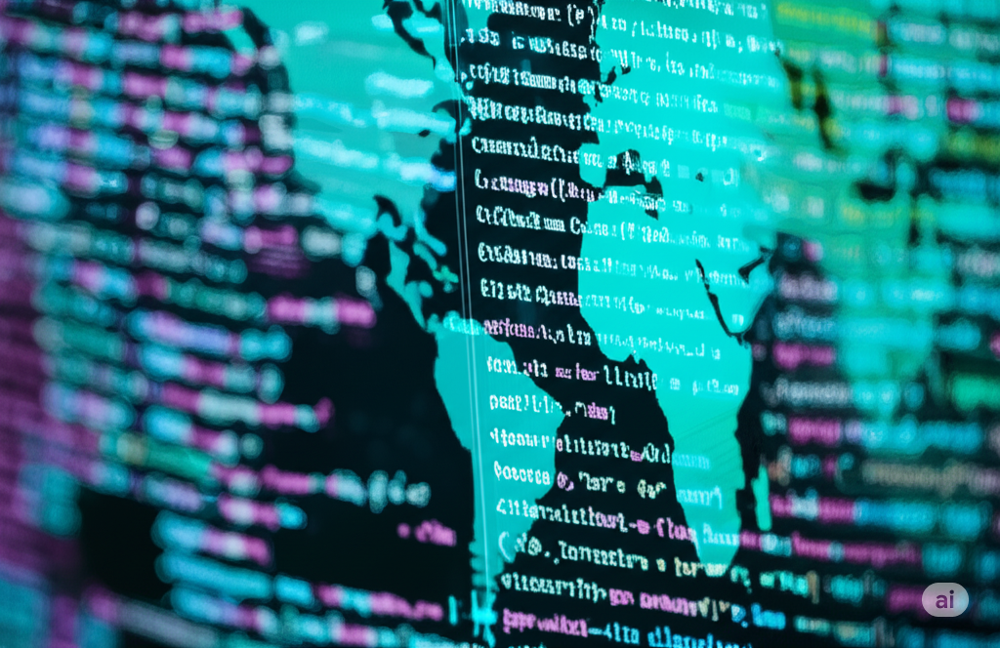

<h1> Olá! Meu nome é Duda Santana! :) </h1>

🎓 Graduanda em <strong>Engenharia de Software</strong> e <strong>Relações Internacionais</strong> 
💻 Focada em desenvolvimento <strong>Full Stack</strong> 
🌍 Busco unir tecnologia e relações globais para atuar em projetos internacionais

<h2>🚀 Em aprendizado</h2>
<ul>
  <li>Python | JavaScript | Java</li>
  <li>HTML, CSS e Git</li>
  <li>Desenvolvimento Web Full Stack</li>
  <li>Integração de sistemas e APIs</li>
</ul>

<h2>🌐 Idiomas</h2>
<ul>
  <li>Português (nativo)</li>
  <li>Inglês (intermediário/avançado)</li>
  <li>Espanhol (intermediário)</li>
  <li>Italiano (básico/intermediário)</li>
</ul>

<h2>🎯 Objetivo</h2>

Aplicar minhas habilidades técnicas e humanas em projetos inovadores com impacto global, conciliando minhas formações para atuar também fora do Brasil.

